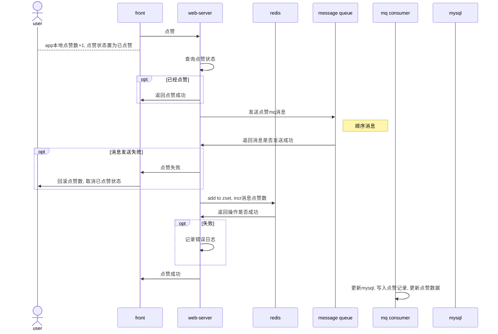
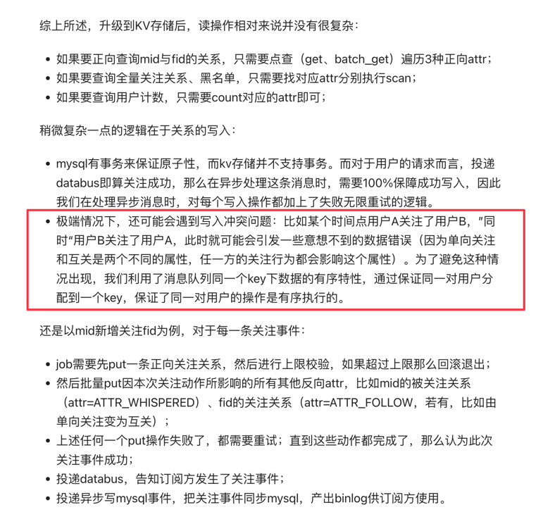
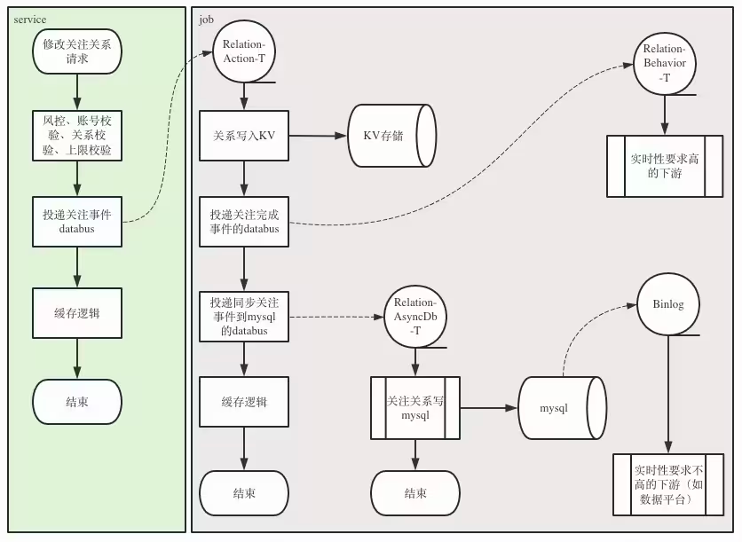
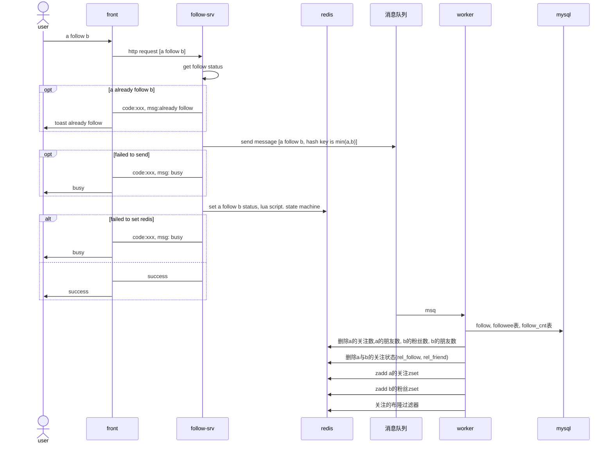
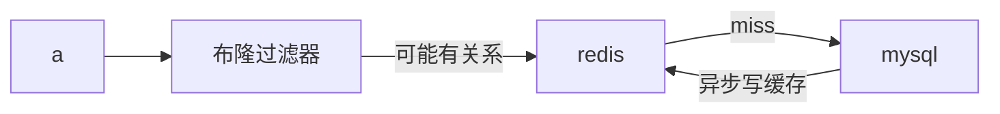
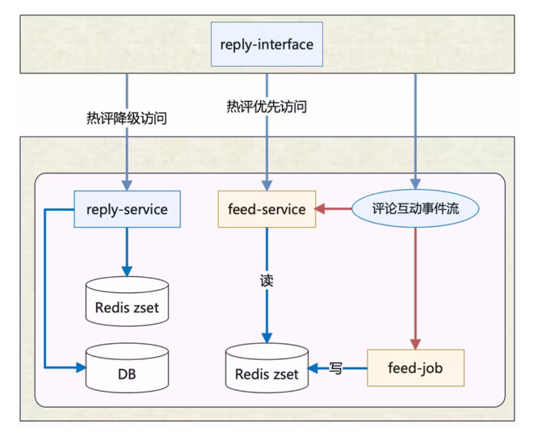
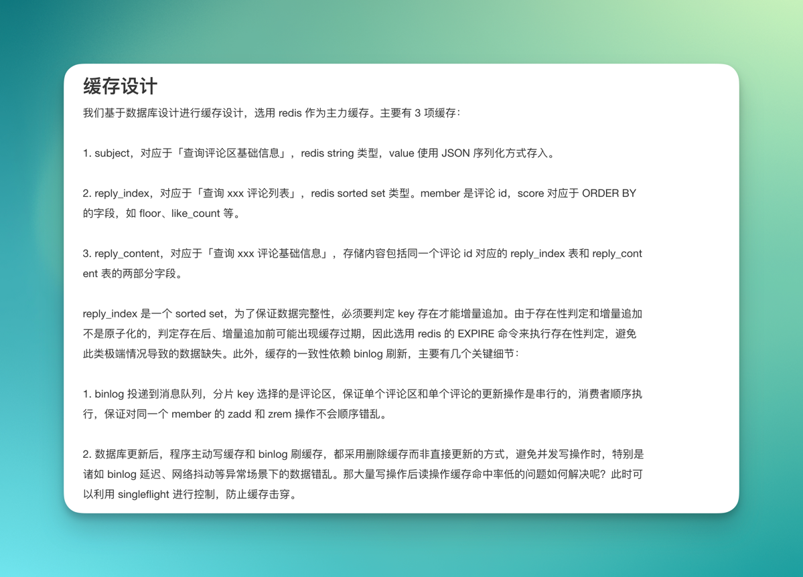
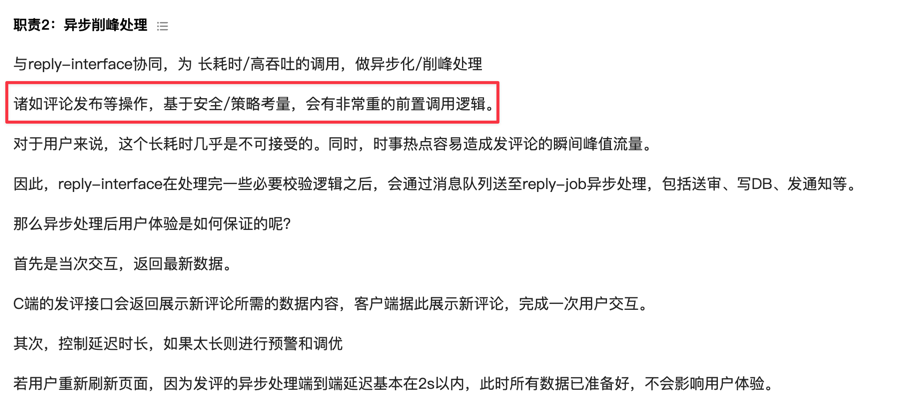

- [点赞系统设计](#点赞系统设计)
  - [需求点](#需求点)
  - [存储设计](#存储设计)
    - [点赞记录表](#点赞记录表)
    - [点赞计数表](#点赞计数表)
    - [点赞流水表](#点赞流水表)
  - [缓存设计](#缓存设计)
  - [mq设计](#mq设计)
    - [消息格式](#消息格式)
  - [流程](#流程)
    - [点赞流程](#点赞流程)
    - [取消点赞](#取消点赞)
    - [批量查询点赞状态](#批量查询点赞状态)
    - [批量查询点赞数](#批量查询点赞数)
- [用户关注系统设计](#用户关注系统设计)
  - [需求点](#需求点-1)
  - [存储设计](#存储设计-1)
    - [关系表](#关系表)
    - [计数表](#计数表)
    - [关注流水表](#关注流水表)
  - [缓存设计](#缓存设计-1)
    - [关注状态缓存](#关注状态缓存)
  - [mq设计](#mq设计-1)
    - [消息格式](#消息格式-1)
  - [详细设计](#详细设计)
    - [关注](#关注)
    - [取消关注](#取消关注)
    - [获取关注数](#获取关注数)
    - [批量获取关注状态](#批量获取关注状态)
    - [分页获取关注列表](#分页获取关注列表)
    - [获取朋友列表](#获取朋友列表)
    - [分页获取粉丝列表](#分页获取粉丝列表)
    - [获取关注数/获取粉丝数](#获取关注数获取粉丝数)
    - [查询全量粉丝列表](#查询全量粉丝列表)
  - [优化](#优化)
    - [热点检测工具](#热点检测工具)
- [动态系统设计](#动态系统设计)
  - [需求点](#需求点-2)
  - [存储设计](#存储设计-2)
    - [动态表](#动态表)
    - [redis](#redis)
  - [详细设计](#详细设计-1)
    - [动态发布](#动态发布)
  - [推送系统设计](#推送系统设计)
    - [推模式的问题](#推模式的问题)
    - [推拉结合](#推拉结合)
      - [方案1. 区分大v/小v(按照粉丝数),](#方案1-区分大v小v按照粉丝数)
    - [方案2 按照用户活跃度, 活跃用户推, 不活跃用户不推.](#方案2-按照用户活跃度-活跃用户推-不活跃用户不推)
- [评论系统设计](#评论系统设计)
  - [需求点](#需求点-3)
    - [数据库](#数据库)
    - [麻烦问题](#麻烦问题)
    - [缓存](#缓存)
      - [id缓存](#id缓存)
      - [评论内容缓存](#评论内容缓存)
    - [存储设计](#存储设计-3)
    - [缓存设计](#缓存设计-2)
  - [详细设计](#详细设计-2)
    - [按时间获取评论列表 可以用数据库index](#按时间获取评论列表-可以用数据库index)
    - [按热度获取评论列表 点赞数经常变,所以只能用redis zset](#按热度获取评论列表-点赞数经常变所以只能用redis-zset)
- [bilibili](#bilibili)

# 点赞系统设计

## 需求点

+ 点赞/取消点赞
+ 批量查询点赞状态
+ 批量查询点赞数
+ 查询最近的点赞记录 500条

## 存储设计

### 点赞记录表

```mysql


```

### 点赞计数表

```sql

create table likes
(
    id          bigint auto_increment comment '主键 snowflake id'
        primary key,
    biz         int       default 0                 not null comment '业务类型 如“动态正文”，“动态评论”，“动态回复”',
    from_uid    int       default 0                 not null comment '点赞人uid',
    to_uid      int       default 0                 not null comment '被点赞人uid',
    eid         bigint    default 0                 not null comment '被点赞的实体id',
    create_time timestamp default CURRENT_TIMESTAMP not null comment '创建时间',
    update_time timestamp default CURRENT_TIMESTAMP not null on update CURRENT_TIMESTAMP comment '更新时间'
)
    comment '点赞表';

create table likes_cnt
(
    id          bigint auto_increment comment '主键' primary key,
    biz         int       default 0                 not null comment '业务类型 如“1 动态正文”，“2 动态评论”，“3 动态回复”',
    eid         bigint    default 0                 not null comment '被点赞的实体id',
    cnt         int       default 0                 not null comment '点赞数量',
    create_time timestamp default CURRENT_TIMESTAMP not null comment '创建时间',
    update_time timestamp default CURRENT_TIMESTAMP not null on update CURRENT_TIMESTAMP comment '更新时间'
) comment '点赞数量表'

```

索引 eid

`select cnt from likes_cnt where eid in (12,34) and biz=1;`

### 点赞流水表

## 缓存设计

|        |             | 备注               |
|--------|-------------|------------------|
| 用途     | 缓存用户最近点赞的动态 |                  |
| 结构     | zset        |                  |
| key    | likes:{uid} |                  |
| member | eid         | 被点赞的实体id         |
| score  | timestamp   | 点赞时间             |
| expire | -1          | 不过期              |
| 长度     | 1000        | 写入数据时截取超过1000的数据 |

|        |                 | 备注                 |
|--------|-----------------|--------------------|
| 用途     | 缓存实体的点赞数        |                    |
| 结构     | string          |                    |
| key    | likes:cnt:{eid} |                    |
| value  | 点赞数             |                    |
| expire | 7天              | 每次更新数据时,同时更新expire |

## mq设计

### 消息格式

## 流程

### 点赞流程



### 取消点赞

### 批量查询点赞状态

### 批量查询点赞数

# 用户关注系统设计



## 需求点

+ 关注
+ 取消关注
+ 获取关注状态 (我关注了你, 我们互相关注)
+ 获取关注列表
+ 获取粉丝列表
+ 获取朋友列表 (朋友为互相关注关系)
+ 获取关注数
+ 获取粉丝数

## 存储设计

存储双向关系, 分表, 读写分离, 异步写数据, redis和mq最终一致性

### 关系表

```sql

# 以from_uid作为sharding key, 用户查询用户是否关注了某人, 查询用户的关注列表


create table follower
(
    id          bigint auto_increment comment '主键',
    from_uid    int       not null comment '关注者',
    to_uid      int       not null comment '被关注者',
    status      tinyint   not null comment '0 无关系 1 单向关注 2 互相关注(朋友)',
    create_time timestamp not null comment '创建时间',
    update_time timestamp not null comment '更新时间',
    primary key (id)
);

# 以to_uid作为sharding key, 查询用户的粉丝列表

create table followee
(
    id          bigint auto_increment comment '主键',
    from_uid    int       not null comment '关注者',
    to_uid      int       not null comment '被关注者',
    status      tinyint   not null comment '0 无关系 1 单向关注 2 互相关注(朋友)',
    create_time timestamp not null comment '创建时间',
    update_time timestamp not null comment '更新时间',
    primary key (id)
);

# a关注b时, 要插入两条记录. follower表和followee表
# 如果b已经关注了a, 那么两者互相关注, status=2, 可能需要更新两条记录


```

### 计数表

```sql

create table follow_cnt
(
    id         bigint auto_increment primary key comment '主键',
    uid        int not null comment '用户id',
    follow_cnt int not null comment '关注数',
    fans_cnt   int not null comment '粉丝数',
    friend_cnt int not null comment '朋友数'
);

# uid加索引
create index follow_cnt_uid_index
    on follow_cnt (uid);
```

### 关注流水表

```sql


create table follow_log
(

    id          bigint auto_increment comment '主键',
    app_id      int          not null comment '应用id',
    uid         int          not null comment '用户id',
    target      int          not null comment '目标id',
    ip          varchar(255) not null comment '客户端ip',
    ct          int          not null comment '客户端类型',
    did         varchar(255) not null comment '设备id',
    op_type     int          not null comment '1-关注，2-取消关注',
    create_time int          not null comment '创建时间',
    primary key (id)

)
```

## 缓存设计

```text
存储用户的关注列表
结构 zset 
key followers:{uid}
member uid, 
score为数据库主键
长度 
过期时间 1周, 过期后增量重建
更新方式 因为重建的代码比较高, 所以不采取更新mysql时删除的方式


缓存用户的粉丝列表
结构 zset 
key followers:{uid}
member uid, 
score为数据库主键
expire 
过期时间 1天, 过期后增量重建
更新方式 因为重建的代码比较高, 所以不采取更新mysql时删除的方式


关注数 cnt:follower:{uid}  更新mysql时删除redis
粉丝数 cnt:fans:{uid} 更新mysql时删除redis

a的关注列表 + 1 zset zadd
b的粉丝列表 + 1 zset zadd


```

### 关注状态缓存

```text
key rel_follow:{a}_b
value 0 a关注b
expire 1d
更新方式 mysql更新后, 删除redis

key rel_friend:{a}_b
value 0 a与b不是朋友, a与b是朋友
expire 1d
更新方式 mysql更新后, 删除redis

key rel_bf:{a}
a关注b时, 把b加入a的布隆过滤器

```

## mq设计

### 消息格式

## 详细设计

### 关注



1. 发mq消息
2. 加入的redis zset关注列表, 增加自己的关注数



在local cache中维护大up主的关注列表

### 取消关注

### 获取关注数

所有的统计数据都是独立字段维护, 保证最终一致性

### 批量获取关注状态

布隆过滤器挡住了大量没关系的请求.
用hash存储关注关系还是用string存储呢?
用hash的话, 过期只能整体过期.一个人的关系中, 只有一小部分是活跃的, 其他的都不经常用到, 用string存储, 可以单独过期.



redis存储朋友关系
a与b的关系

1 a关注了b
2 互相关注

异步更新朋友列表, 时序问题

开始a没有关注b, b关注了a
然后a关注b, 同时b取消关注a
如果两者互斥, 可以保证最终的结果是a关注b.

### 分页获取关注列表

直接查询redis zset

```text
pageNum pageSize
查询 redis中关注数
offset =  (pageNum-1)*pageSize
end = min(offset + pageSize, follow_cnt)
如果 offset >= follow_cnt, 返回没有数据呢
要在zset中找的范围是 [offset, end)
    如果end大于zset len, 要从mysql中查询 pageNum, pageSize数据
        然后异步goroutine放到redis中
        把 zset最小的id开始, 查三页, 更新到redis中.
    
```

[//]: # (### 获取全量关注列表)

### 获取朋友列表

```text
pageNum pageSize
查询 redis中关注数
offset =  (pageNum-1)*pageSize
end = min(offset + pageSize, follow_cnt)
如果 offset >= follow_cnt, 返回没有数据呢
要在zset中找的范围是 [offset, end)
    如果end大于zset len, 要从mysql中查询 pageNum, pageSize数据
        然后异步goroutine放到redis中
        把 zset最小的id开始, 查三页, 更新到redis中.
    
```

### 分页获取粉丝列表

查粉丝数, 如果粉丝数大于redis缓存zset的长度, miss后查询mysql, 异步回填redis

1. 其他人查询 只能查前几页 直接查询redis, miss后查询mysql, 异步回填redis
2. 自己查询呢? 查redis

### 获取关注数/获取粉丝数

### 查询全量粉丝列表

推送服务, 用于推送消息 查mysql

## 优化

### 热点检测工具

热点检测工具

# 动态系统设计

## 需求点

+ 发动态
+ 删除动态
+ 修改动态
+ 用户timeline, 用户个人的动态列表
+ 关注者timeline, 获取关注人的动态列表
+ 动态广场, 所有人的动态列表
+ 推荐列表
+ 话题timeline
+ 动态排序, 热度,时间

## 存储设计

### 动态表

```sql
-- auto-generated definition
create table feeds
(
    id             bigint auto_increment comment '主键 snowflake id'
        primary key,
    biz            int          default 0                 not null comment '业务id',
    uid            int          default 0                 not null comment '用户 id',
    content        varchar(255) default ''                not null comment '内容',
    images         varchar(255) default ''                not null comment '逗号分隔的图片url',
    topic_ids      varchar(255) default ''                not null comment '逗号分隔的话题id',
    ip_address     varchar(255) default ''                not null comment '用户发帖时的地址',
    deleted        tinyint      default 0                 not null comment '删除 0 否 1 是',
    deleted_reason tinyint      default 0                 not null comment '删除原因 0 未删除 1 用户主动删除 2 审核不通过删除',
    audit_status   tinyint      default 0                 not null comment '审核状态 0 审核中 1 审核通过 2 审核不通过',
    create_time    timestamp    default CURRENT_TIMESTAMP not null,
    update_time    timestamp    default CURRENT_TIMESTAMP not null
)
    comment '动态表 按照uid分表';

create index feeds_uid_index
    on feeds (uid);

```

### redis

缓存动态

```text
cdn缓存
内存缓存
redis缓存
mysql缓存
```

## 详细设计


### 动态发布
+ 幂等 用户多次点击发布按钮
+ 网络问题导致动态发送失败解决
+ 图片防盗链


## 推送系统设计

### 推模式的问题

1. 写放大
2. 推送可能不及时

### 推拉结合

#### 方案1. 区分大v/小v(按照粉丝数),

大v拉, 小v推. 拉大v的发件箱, 实时

+ 难点1 现在关注服务只能分页读取关注列表. 读全量关注列表对关注服务压力比较大
+ 难点2 聚合实现复杂

### 方案2 按照用户活跃度, 活跃用户推, 不活跃用户不推.

活跃用户上线后, 异步增量拉动态id到收件箱

# 评论系统设计

## 需求点

+ 发表评论
+ 回复“评论”, 回复“回复”
+ 删除评论/回复
+ 评论计数
+ 按时间获取评论列表 可以用数据库index
+ 按热度获取评论列表 点赞数经常变,所以只能用redis zset
+ 分页获取回复列表

### 数据库

评论表和回复表

要维护评论区的计数和每个评论的计数

### 麻烦问题

热度排序, 深分页问题

```sql

create table comment_subject
(
    id          bigint auto_increment comment '主键'
        primary key,
    biz         int       default 0                 not null comment '业务类型id',
    subject_id  bigint    default 0                 not null comment '被评论的主题id',
    subject_uid int       default 0                 not null comment '被评论的主题用户id',
    count       int       default 0                 not null comment '总评论数(包括回复)',
    root_count  int       default 0                 not null comment '评论数(不包括回复)',
    create_time timestamp default CURRENT_TIMESTAMP not null comment '创建时间',
    update_time timestamp default CURRENT_TIMESTAMP not null on update CURRENT_TIMESTAMP comment '更新时间'

) comment '评论主题表';

-- auto-generated definition
create table comment_index
(
    id             bigint auto_increment comment '评论id'
        primary key,
    biz            int          default 0                 not null comment '业务id',
    subject_id     bigint       default 0                 not null comment '评论主题id',
    uid            int          default 0                 not null comment '发表者用户id',
    parent         int          default 0                 not null comment '父评论id',
    root           int          default 0                 not null comment '根评论id',
    floor          int unsigned default 0                 not null comment '楼层',
    count          int          default 0                 not null comment '评论的回复数',
    deleted        tinyint      default 0                 not null comment '删除 0 否 1 是',
    deleted_reason tinyint      default 0                 not null comment '删除原因 0 未删除 1 用户主动删除 2 审核不通过删除',
    audit_status   tinyint      default 0                 not null comment '审核状态 0 审核中 1 审核通过 2 审核不通过',
    create_time    timestamp    default CURRENT_TIMESTAMP not null comment '创建时间',
    update_time    timestamp    default CURRENT_TIMESTAMP not null on update CURRENT_TIMESTAMP comment '更新时间'
)
    comment '评论索引表';

create index idx_uid
    on replies (from_uid);


create table comment_content
(
    comment_id  bigint auto_increment comment '评论id'
        primary key,
    content     varchar(255) default ''                not null comment '评论内容',
    ip          bigint       default ''                not null comment 'ip地址',
    create_time timestamp    default CURRENT_TIMESTAMP not null comment '创建时间',
    update_time timestamp    default CURRENT_TIMESTAMP not null on update CURRENT_TIMESTAMP comment '更新时间'
)

```

### 缓存

#### id缓存

评论id缓存, 回复id缓存

zset

value comment id
score timestamp评论时间 或like count
expire 24h

#### 评论内容缓存

一级评论内容, 二级评论内容

key
cmt:content:biz:{id} biz是业务id, 比如动态正文, 动态评论, 动态回复, id是实体id
value
评论内容 json
expire 24h

binlog消费, 更新重建缓存

### 存储设计

### 缓存设计

热评几乎完全依赖sorted set这样的数据结构，预先计算好排序分数并写入。于是在架构设计上，新增了feed-service和feed-job来支撑热评列表的读写


如果一个很老的视频, 很久没人访问他, 那么他在redis中的缓存肯定失效了,
假如这时候突然有人访问他, 这时候要重建他的评论区缓存, 如果他的评论区很大, 需要全量的重建吗?

数据库更新后，程序主动写缓存和 binlog 刷缓存，都采用删除缓存而非直接更新的方式，避免并发写操作时，特别是诸如 binlog
延迟、网络抖动等异常场景下的数据错乱。那大量写操作后读操作缓存命中率低的问题如何解决呢？此时可以利用 singleflight
进行控制，防止缓存击穿。




内容社区有比较重的前置操作, 所以发帖需要异步.

1. 比如风控(拦截打广告用户,其他平台拉人等, 大数据风控更具ip,uid,手机号之类的进行拦截)
2. 文本敏感词校验 (大数据接口)
3. 写db落库
4. 送审

异步操作如何保证用户体验.

1. 前端调用接口后, 马上再页面上显示用户的评论
2. 服务端保证2s内能写db. 保证用户体验. 中间过程有问题就发站内信提示用户.
3. 用户刷新时, 先读cache, 没有在读db, 发cache miss消息, 异步重建缓存

新增评论的刷新通过 zadd, zrem

zadd和zrem是幂等的

非幂等更新是, 监听到binlog后对缓存的操作是删除, 然后读操作是重新写入缓存

ret = exire key 1000
if ret:
zadd xxx id

先新增评论, 再删除评论
然后binlog延迟

## 详细设计

### 按时间获取评论列表 可以用数据库index

### 按热度获取评论列表 点赞数经常变,所以只能用redis zset

# bilibili

热度排序, session id 服务端去重
服务端用redis的set存看过的评论id和用户看过的进度.

服务端存储用于翻页的进度. 进度数据存储再redis中, 用session id作为key.

用户请求第一页评论时, 服务端生产一个session id, 以此作为key存储用户看过的评论id集合和用户看到页码
用户每用session id请求评论时, 服务端根据session id取出用户看过的评论id集合和用户看到的页码, 从数据库中取出下一页评论,
然后过滤掉用户看过的评论id, 返回给用户

