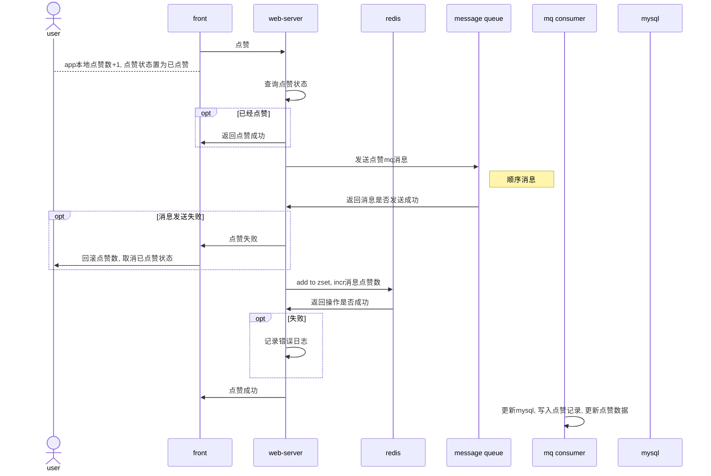

- [点赞系统设计](#点赞系统设计)
  - [需求点](#需求点)
  - [存储](#存储)
    - [mysql](#mysql)
      - [点赞记录表](#点赞记录表)
      - [点赞计数表](#点赞计数表)
    - [redis](#redis)
  - [流程](#流程)
    - [点赞流程](#点赞流程)
    - [取消点赞](#取消点赞)
    - [批量查询点赞状态](#批量查询点赞状态)
    - [批量查询点赞数](#批量查询点赞数)
- [用户关注系统设计](#用户关注系统设计)
  - [需求点](#需求点-1)
  - [详细设计](#详细设计)
    - [mysql](#mysql-1)
    - [redis](#redis-1)
    - [关注](#关注)
    - [取消关注](#取消关注)
    - [获取关注数](#获取关注数)
    - [批量获取关注关系](#批量获取关注关系)
    - [获取关注列表](#获取关注列表)
    - [获取粉丝列表](#获取粉丝列表)
    - [获取朋友列表 (朋友为互相关注关系)](#获取朋友列表-朋友为互相关注关系)
    - [获取关注数/获取粉丝数](#获取关注数获取粉丝数)
- [动态系统设计](#动态系统设计)
  - [需求点](#需求点-2)
  - [详细设计](#详细设计-1)
    - [数据库](#数据库)
    - [redis](#redis-2)
- [评论系统设计](#评论系统设计)
  - [需求点](#需求点-3)
  - [详细设计](#详细设计-2)
    - [数据库](#数据库-1)

# 点赞系统设计

## 需求点

+ 点赞/取消点赞
+ 批量查询点赞状态
+ 批量查询点赞数

## 存储

### mysql

#### 点赞记录表

```mysql


```

#### 点赞计数表

```sql

create table likes
(
    id          bigint auto_increment comment '主键 snowflake id'
        primary key,
    biz         int       default 0                 not null comment '业务类型 如“动态正文”，“动态评论”，“动态回复”',
    from_uid    int       default 0                 not null comment '点赞人uid',
    to_uid      int       default 0                 not null comment '被点赞人uid',
    eid         bigint    default 0                 not null comment '被点赞的实体id',
    create_time timestamp default CURRENT_TIMESTAMP not null comment '创建时间',
    update_time timestamp default CURRENT_TIMESTAMP not null on update CURRENT_TIMESTAMP comment '更新时间'
)
    comment '点赞表';

create table likes_cnt
(
    id          bigint auto_increment comment '主键' primary key,
    biz         int       default 0                 not null comment '业务类型 如“1 动态正文”，“2 动态评论”，“3 动态回复”',
    eid         bigint    default 0                 not null comment '被点赞的实体id',
    cnt         int       default 0                 not null comment '点赞数量',
    create_time timestamp default CURRENT_TIMESTAMP not null comment '创建时间',
    update_time timestamp default CURRENT_TIMESTAMP not null on update CURRENT_TIMESTAMP comment '更新时间'
) comment '点赞数量表'

```

索引 eid

`select cnt from likes_cnt where eid in (12,34) and biz=1;`

### redis

|        |             | 备注               |
|--------|-------------|------------------|
| 用途     | 缓存用户最近点赞的动态 |                  |
| 结构     | zset        |                  |
| key    | likes:{uid} |                  |
| member | eid         | 被点赞的实体id         |
| score  | timestamp   | 点赞时间             |
| expire | -1          | 不过期              |
| 长度     | 1000        | 写入数据时截取超过1000的数据 |

|        |                 | 备注                 |
|--------|-----------------|--------------------|
| 用途     | 缓存实体的点赞数        |                    |
| 结构     | string          |                    |
| key    | likes:cnt:{eid} |                    |
| value  | 点赞数             |                    |
| expire | 7天              | 每次更新数据时,同时更新expire |

## 流程

### 点赞流程



### 取消点赞

### 批量查询点赞状态

### 批量查询点赞数

# 用户关注系统设计

## 需求点

+ 关注
+ 取消关注
+ 获取关注状态 (我关注了你, 我们互相关注)
+ 获取关注列表
+ 获取粉丝列表
+ 获取朋友列表 (朋友为互相关注关系)
+ 获取关注数
+ 获取粉丝数

## 详细设计

### mysql

存储双向关系, 分表, 读写分离, 异步写数据, redis和mq最终一致性

```sql

# 以from_uid作为sharding key, 用户查询用户是否关注了某人, 查询用户的关注列表
# id 主键
# from_uid 关注者
# to_uid 被关注者
# is_follow 是否互关 冗余字段
# create_time 创建时间
# 唯一索引 from_uid, to_uid 
# 联合索引 (from_uid, id) 

create table fans
(
    id          bigint auto_increment comment '主键',
    from_uid    int     not null comment '关注者',
    to_uid      int     not null comment '被关注者',
    is_follow   tinyint not null comment '是否互相关注',
    create_time int     not null comment '创建时间',
    primary key (id)
);


# 以to_uid作为sharding key, 查询用户的粉丝列表
# id 主键
# from_uid 关注者
# to_uid 被关注者
# is_follow 是否互关
# create_time 创建时间
# 唯一索引 (to_uid, from_uid)
# 联合索引 (to_uid, id)
#     
create table followers
(
    id          bigint auto_increment comment '主键',
    from_uid    int     not null comment '关注者',
    to_uid      int     not null comment '被关注者',
    is_follow   tinyint not null comment '是否互相关注',
    create_time int     not null comment '创建时间',
    primary key (id)
);

# 关注计数表
# uid 用户id
# follow_count 关注数
# fan_count 粉丝数
# friend_count 朋友数


create table follow_cnt
(
    id         bigint auto_increment comment '主键',
    uid        int not null comment '用户id',
    follow_cnt int not null comment '关注数',
    fan_cnt    int not null comment '粉丝数',
    friend_cnt int not null comment '朋友数',
    primary key (id)

);

# uid加索引
create index follow_cnt_uid_index
    on follow_cnt (uid);


```

关注流水表

```sql


create table follow_log
(

    id          bigint auto_increment comment '主键',
    app_id      int          not null comment '应用id',
    uid         int          not null comment '用户id',
    target      int          not null comment '目标id',
    ip          varchar(255) not null comment '客户端ip',
    ct          int          not null comment '客户端类型',
    did         varchar(255) not null comment '设备id',
    op_type     int          not null comment '1-关注，2-取消关注',
    create_time int          not null comment '创建时间',
    primary key (id)

)


```

### redis

```text
存储用户的关注列表
结构 zset 
key followers:{uid}
member uid, 
score为关注时间
长度 
过期时间

缓存用户的粉丝列表
结构 zset 
key followers:{uid}
member uid, 
score为关注时间

关注数 cnt:follower:{uid}
粉丝数 cnt:fans:{uid}


```

### 关注

1. 发mq消息
2. 加入的redis zset关注列表, 增加自己的关注数

### 取消关注

### 获取关注数

所有的统计数据都是独立字段维护, 保证最终一致性

### 批量获取关注关系

redis存储朋友关系
a与b的关系

1 a关注了b
2 互相关注

异步更新朋友列表, 时序问题

开始a没有关注b, b关注了a
然后a关注b, 同时b取消关注a
如果两者互斥, 可以保证最终的结果是a关注b.

### 获取关注列表

直接查询redis

### 获取粉丝列表

直接查询redis,

### 获取朋友列表 (朋友为互相关注关系)

直接查询redis

### 获取关注数/获取粉丝数

# 动态系统设计

## 需求点

+ 发动态
+ 删除动态
+ 修改动态
+ 用户timeline, 用户个人的动态列表
+ 关注者timeline, 获取关注人的动态列表
+ 动态广场, 所有人的动态列表
+ 推荐列表
+ 话题timeline
+ 动态排序, 热度,时间

## 详细设计

### 数据库

```sql
-- auto-generated definition
create table feeds
(
    id             bigint auto_increment comment '主键 snowflake id'
        primary key,
    biz            int          default 0                 not null comment '业务id',
    uid            int          default 0                 not null comment '用户 id',
    content        varchar(255) default ''                not null comment '内容',
    images         varchar(255) default ''                not null comment '逗号分隔的图片url',
    topic_ids      varchar(255) default ''                not null comment '逗号分隔的话题id',
    ip_address     varchar(255) default ''                not null comment '用户发帖时的地址',
    deleted        tinyint      default 0                 not null comment '删除 0 否 1 是',
    deleted_reason tinyint      default 0                 not null comment '删除原因 0 未删除 1 用户主动删除 2 审核不通过删除',
    audit_status   tinyint      default 0                 not null comment '审核状态 0 审核中 1 审核通过 2 审核不通过',
    create_time    timestamp    default CURRENT_TIMESTAMP not null,
    update_time    timestamp    default CURRENT_TIMESTAMP not null
)
    comment '动态表 按照uid分表';

create index feeds_uid_index
    on feeds (uid);


```

### redis

缓存动态

```text
cdn缓存
内存缓存
redis缓存
mysql缓存
```

# 评论系统设计

## 需求点

+ 发表评论
+ 回复“评论”, 回复“回复”
+ 删除评论/回复
+ 获取总评论数
+ 分页获取评论列表
+ 分页获取回复列表

## 详细设计

### 数据库

```sql
-- auto-generated definition
create table comments
(
    id             bigint auto_increment comment '评论id'
        primary key,
    biz            int          default 0                 not null comment '业务id',
    subject_id     bigint       default 0                 not null comment '主题id',
    uid            int          default 0                 not null comment '评论用户uid',
    content        varchar(255) default ''                not null comment '评论内容',
    ip             varchar(255) default ''                not null comment '发帖地址',
    deleted        tinyint      default 0                 not null comment '删除 0 否 1 是',
    deleted_reason tinyint      default 0                 not null comment '删除原因 0 未删除 1 用户主动删除 2 审核不通过删除',
    audit_status   tinyint      default 0                 not null comment '审核状态 0 审核中 1 审核通过 2 审核不通过',
    create_time    timestamp    default CURRENT_TIMESTAMP not null comment '创建时间',
    update_time    timestamp    default CURRENT_TIMESTAMP not null on update CURRENT_TIMESTAMP comment '更新时间'
)
    comment '评论表';

create index idx_uid
    on comments (uid);

-- auto-generated definition
create table replies
(
    id             bigint auto_increment comment '回复id'
        primary key,
    biz            int          default 0                 not null comment '业务id',
    typ            tinyint      default 0                 not null comment '回复类型 0 回复“评论” 1 回复“回复”',
    eid            bigint       default 0                 not null comment '主题id  冗余的动态 id',
    comment_id     bigint       default 0                 not null comment '回复的评论id',
    reply_id       bigint       default 0                 not null comment '回复的回复id',
    from_uid       int          default 0                 not null comment '回复用户id',
    to_uid         int          default 0                 not null comment '被回复用户id',
    content        varchar(255) default ''                not null comment '回复内容',
    ip             varchar(255) default ''                not null comment 'ip地址',
    deleted        tinyint      default 0                 not null comment '删除 0 否 1 是',
    deleted_reason tinyint      default 0                 not null comment '删除原因 0 未删除 1 用户主动删除 2 审核不通过删除',
    audit_status   tinyint      default 0                 not null comment '审核状态 0 审核中 1 审核通过 2 审核不通过',
    create_time    timestamp    default CURRENT_TIMESTAMP not null comment '创建时间',
    update_time    timestamp    default CURRENT_TIMESTAMP not null on update CURRENT_TIMESTAMP comment '更新时间'
)
    comment '回复表';

create index idx_uid
    on replies (from_uid);


```


